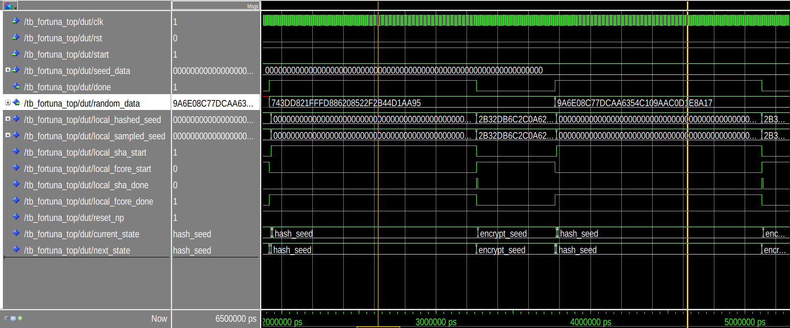

# Fortuna-CSPRNG

Hardware implementation of a simplified version of the Cryptographically Secure Pseudorandom Number Generator Fortuna such as described in the book of N. Ferguson and B. Schneier:

> N. Ferguson and B. Schneier, Practical Cryptography, Wiley Publishing, Inc., 2003

However this implementation doesn't include the entropy accumulator such as described by the authors, the designer is free to implement their own entropy source in order to seed the PRNG.

The design of the top module of Fortuna-CSPRNG is depicted in the following figure :

<div style="display: flex; justify-content: center; align-items: center;">
  
</div>

<div style="display: flex; justify-content: center; align-items: center;">
  
</div>

The design generates 16 random bytes at a time:

```
Throughput = 8.65 MB/s
```

# How to run 

To run the self-testing test-benches
If you have modelsim added to ``$PATH`` just run : 

```
make
```
In the desired root directory.
